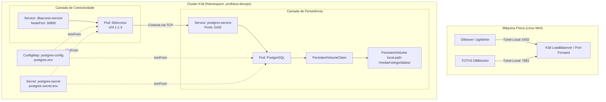

# Protheus Devops Stack - Local Kubernetes Cluster

Ambiente de desenvolvimento Protheus em alta performance rodando localmente em cluster Kubernetes de nó único (**K3d/K3s**), focado em isolamento de pilha, automação de infraestrutura e portabilidade entre desenvolvedores.

## 🏗️ Arquitetura do Ambiente

A stack adota isolamento completo de rede via Namespace e injeção dinâmica de variáveis de ambiente locais ignoradas pelo Git (`.env`), garantindo a independência das credenciais de cada desenvolvedor.



### 🛠️ Pré-requisitos & Armazenamento

O `cluster K3d` utiliza o `local-path provisioner` do K3s apontando para o volume físico montado em:

Caminho: `/media/rodrigo/dados/`

Os manifestos bases estão estruturados via Kustomize dentro do diretório `base/`.

### 🚀 Como Executar e Validar

1. Inicializar os recursos

```bash
kubectl apply -k base/
```
2. Validar o Banco de Dados (`PostgreSQL`)

Crie um redirecionamento de porta para acessar o banco externamente via `DBeaver` ou similar:

```bash
kubectl port-forward deployment/postgres 5432:5432 -n protheus-devops
```

`Host`: localhost | `Porta`: 5432 | `Banco`: Conforme configurado no `postgres.env`

3. Validar a Conectividade (`DbAccess`)

Caso a porta nativa 7890 esteja ocupada por instâncias locais da máquina host, direcione para uma porta alternativa para abrir no `DBMonitor`:

```bash
kubectl port-forward deployment/dbaccess 7891:7890 -n protheus-devops
```

### 🔄 GitOps: Argo CD + Image Updater

Este repositório é o alvo de sincronização de um `Application` do Argo CD (sync automático + `selfHeal`), que por sua vez é observado por um `ImageUpdater` (Argo CD Image Updater) rastreando as imagens `dbaccess-dev` e `postgres-protheus-dev` por **digest** — a cada novo build publicado no Docker Hub sob a mesma tag fixa, o Image Updater detecta o novo digest, faz o patch do `Application` (write-back method `argocd`) e o Argo CD sincroniza automaticamente.

Os manifestos desses dois recursos (`Application` e `ImageUpdater`) ficam versionados em [`argocd/`](argocd/), pois eles vivem no namespace `argocd` do cluster, fora do que o Kustomize em `base/` gerencia — sem isso, a integração entre o Argo CD e este repositório existiria apenas como estado vivo do cluster, sem nenhum registro em git.

**Bootstrap / Disaster Recovery** — se o cluster for recriado do zero, os únicos dois comandos necessários para reestabelecer toda a integração GitOps são:

```bash
kubectl apply -f argocd/application.yaml
kubectl apply -f argocd/image-updater.yaml
```

(pré-requisito: Argo CD e Argo CD Image Updater já instalados no cluster via Helm, namespace `argocd`). Depois disso, o `Application` puxa `base/` deste repositório e o `ImageUpdater` volta a rastrear os digests automaticamente — nenhum passo manual adicional.


