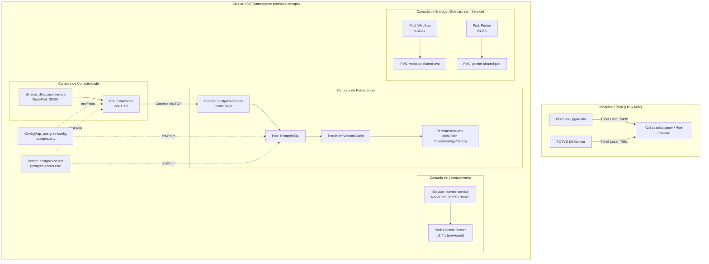

# Protheus Devops Stack - Local Kubernetes Cluster

Ambiente de desenvolvimento Protheus em alta performance rodando localmente em cluster Kubernetes de nó único (**K3d/K3s**), focado em isolamento de pilha, automação de infraestrutura e portabilidade entre desenvolvedores.

## 🏗️ Arquitetura do Ambiente

A stack adota isolamento completo de rede via Namespace e injeção dinâmica de variáveis de ambiente locais ignoradas pelo Git (`.env`), garantindo a independência das credenciais de cada desenvolvedor.



### 🛠️ Pré-requisitos & Armazenamento

O `cluster K3d` utiliza o `local-path provisioner` do K3s apontando para o volume físico montado em:

Caminho: `/media/rodrigo/dados/`

Os manifestos bases estão estruturados via Kustomize dentro do diretório `base/`.

### 🚀 Como Executar e Validar

1. Inicializar os recursos

```bash
kubectl apply -k base/
```
2. Validar o Banco de Dados (`PostgreSQL`)

Crie um redirecionamento de porta para acessar o banco externamente via `DBeaver` ou similar:

```bash
kubectl port-forward deployment/postgres 5432:5432 -n protheus-devops
```

`Host`: localhost | `Porta`: 5432 | `Banco`: Conforme configurado no `postgres.env`

3. Validar a Conectividade (`DbAccess`)

Caso a porta nativa 7890 esteja ocupada por instâncias locais da máquina host, direcione para uma porta alternativa para abrir no `DBMonitor`:

```bash
kubectl port-forward deployment/dbaccess 7891:7890 -n protheus-devops
```

4. Validar o License Server

```bash
kubectl port-forward deployment/license 5555:5555 -n protheus-devops
```

**Nota de segurança**: o Pod do `license` roda com `securityContext.privileged: true` e monta `/dev/mem` do host (`hostPath`). Isso replica o `cap_add: SYS_RAWIO` + `devices: /dev/mem:/dev/mem` que o `docker-compose` original já usava — o binário da TOTVS (via `dmidecode`, empacotado na imagem) lê `/dev/mem` para gerar o fingerprint de hardware ao qual a licença é vinculada. Sem um device plugin dedicado, o Kubernetes só libera esse acesso via `privileged: true`. Como o node do K3d roda no mesmo host físico da máquina de desenvolvimento, o fingerprint resultante é o mesmo de quando a licença rodava via `docker-compose`.

5. `WebApp` e `Printer` (sidecars de entrega)

`webapp` e `printer` são binários com versionamento independente do AppServer — cada um roda numa imagem exclusiva justamente para poder ser atualizado sozinho (nova versão do WebApp ou do Printer) sem precisar rebuildar ou reiniciar o AppServer. Eles não expõem porta nenhuma: o único trabalho de cada um é extrair seu binário para um `PersistentVolumeClaim` dedicado (`webapp-shared-pvc`, `printer-shared-pvc`) e ficar em standby. Não há verificação via `port-forward` aqui — a validação é conferir que os arquivos foram extraídos:

```bash
kubectl exec deployment/webapp -n protheus-devops -- ls /mnt/webapp_shared
kubectl exec deployment/printer -n protheus-devops -- ls /mnt/printer_shared
```

Esses dois PVCs ainda não têm consumidor: `base/appserver.yaml` (ainda incompleto/WIP, fora do escopo de automação atual) precisará montá-los como somente-leitura quando for finalizado, do mesmo jeito que o `docker-compose` original montava `webapp_shared_module` e `protheus_printer_volume` em `/tmp/webapp_shared:ro` e `/tmp/printer_shared:ro` dentro do `appserver_core`.

### 🔄 GitOps: Argo CD + Image Updater

Este repositório é o alvo de sincronização de um `Application` do Argo CD (sync automático + `selfHeal`), que por sua vez é observado por um `ImageUpdater` (Argo CD Image Updater) rastreando as imagens `dbaccess-dev`, `postgres-protheus-dev`, `license-dev`, `webapp-dev` e `printer-dev` por **digest** — a cada novo build publicado no Docker Hub sob a mesma tag fixa, o Image Updater detecta o novo digest, faz o patch do `Application` (write-back method `argocd`) e o Argo CD sincroniza automaticamente.

Os manifestos desses dois recursos (`Application` e `ImageUpdater`) ficam versionados em [`argocd/`](argocd/), pois eles vivem no namespace `argocd` do cluster, fora do que o Kustomize em `base/` gerencia — sem isso, a integração entre o Argo CD e este repositório existiria apenas como estado vivo do cluster, sem nenhum registro em git.

**Bootstrap / Disaster Recovery** — se o cluster for recriado do zero, os únicos dois comandos necessários para reestabelecer toda a integração GitOps são:

```bash
kubectl apply -f argocd/application.yaml
kubectl apply -f argocd/image-updater.yaml
```

(pré-requisito: Argo CD e Argo CD Image Updater já instalados no cluster via Helm, namespace `argocd`). Depois disso, o `Application` puxa `base/` deste repositório e o `ImageUpdater` volta a rastrear os digests automaticamente — nenhum passo manual adicional.

### 🏷️ Estratégia de Tags do Fleet

Todos os repositórios `docker-*` que alimentam este cluster publicam suas imagens sob **tags fixas/estáticas** (ex.: `dbaccess-dev:24.1.1.3`, `postgres-protheus-dev:16`) — a tag só muda quando a TOTVS libera uma nova versão do binário, não a cada commit/build. Essa é uma decisão deliberada, não uma limitação:

* O Image Updater rastreia essas imagens por **digest** (`updateStrategy: digest`), então um novo build sob a mesma tag já é detectado e sincronizado automaticamente — não é necessário mudar a tag a cada release para o GitOps funcionar.
* Migrar para tags git-sha ou semver por build exigiria reconfigurar a strategy do Image Updater em todo componente já integrado (de `digest` para `latest`/semver-sorting) e geraria um volume de tags no Docker Hub desproporcional ao ritmo real de mudança do software (release da TOTVS, não commit).
* A lacuna real desse modelo — não dá pra olhar uma imagem rodando e saber de qual commit ela veio, já que a tag não muda — foi fechada sem tocar na tag: todo `pipeline` dos repos `docker-*` agora grava o label `org.opencontainers.image.revision` com o SHA do commit em cada imagem publicada (`docker inspect` revela a proveniência exata).


