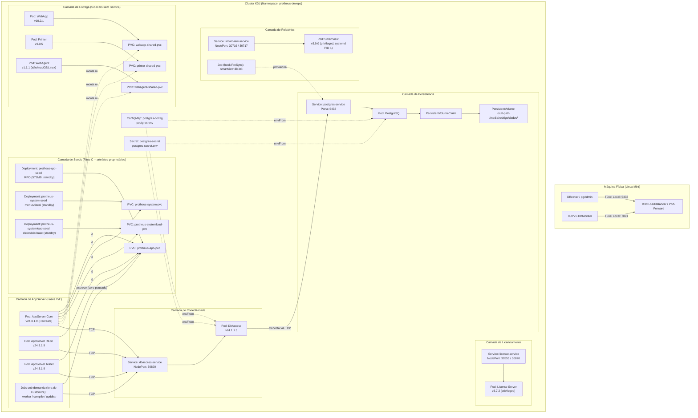

# Protheus Devops Stack - Local Kubernetes Cluster

Ambiente de desenvolvimento Protheus em alta performance rodando localmente em cluster Kubernetes de nó único (**K3d/K3s**), focado em isolamento de pilha, automação de infraestrutura e portabilidade entre desenvolvedores.

## 🏗️ Arquitetura do Ambiente

A stack adota isolamento completo de rede via Namespace e injeção dinâmica de variáveis de ambiente locais ignoradas pelo Git (`.env`), garantindo a independência das credenciais de cada desenvolvedor.



### 🛠️ Pré-requisitos & Armazenamento

O `cluster K3d` utiliza o `local-path provisioner` do K3s apontando para o volume físico montado em:

Caminho: `/media/rodrigo/dados/`

Os manifestos bases estão estruturados via Kustomize dentro do diretório `base/`.

### 🚀 Como Executar e Validar

1. Inicializar os recursos

```bash
kubectl apply -k base/
```
2. Validar o Banco de Dados (`PostgreSQL`)

Crie um redirecionamento de porta para acessar o banco externamente via `DBeaver` ou similar:

```bash
kubectl port-forward deployment/postgres 5432:5432 -n protheus-devops
```

`Host`: localhost | `Porta`: 5432 | `Banco`: Conforme configurado no `postgres.env`

3. Validar a Conectividade (`DbAccess`)

Caso a porta nativa 7890 esteja ocupada por instâncias locais da máquina host, direcione para uma porta alternativa para abrir no `DBMonitor`:

```bash
kubectl port-forward deployment/dbaccess 7891:7890 -n protheus-devops
```

4. Validar o License Server

```bash
kubectl port-forward deployment/license 5555:5555 -n protheus-devops
```

**Nota de segurança**: o Pod do `license` roda com `securityContext.privileged: true` e monta `/dev/mem` do host (`hostPath`). Isso replica o `cap_add: SYS_RAWIO` + `devices: /dev/mem:/dev/mem` que o `docker-compose` original já usava — o binário da TOTVS (via `dmidecode`, empacotado na imagem) lê `/dev/mem` para gerar o fingerprint de hardware ao qual a licença é vinculada. Sem um device plugin dedicado, o Kubernetes só libera esse acesso via `privileged: true`. Como o node do K3d roda no mesmo host físico da máquina de desenvolvimento, o fingerprint resultante é o mesmo de quando a licença rodava via `docker-compose`.

5. `WebApp`, `Printer` e `WebAgent` (sidecars de entrega)

`webapp`, `printer` e `webagent` são binários com versionamento independente do AppServer — cada um roda numa imagem exclusiva justamente para poder ser atualizado sozinho (nova versão do WebApp, Printer ou WebAgent) sem precisar rebuildar ou reiniciar o AppServer. Nenhum expõe porta: o único trabalho de cada um é extrair seus arquivos para um `PersistentVolumeClaim` dedicado (`webapp-shared-pvc`, `printer-shared-pvc`, `webagent-shared-pvc`) e ficar em standby. `webagent` é diferente dos outros dois numa coisa: é um utilitário **client-side** (roda na estação do usuário final, não no servidor) — este Pod só entrega os instaladores (Windows x86/x64 `.exe`, macOS Universal/x64 `.dmg`, Linux `.deb`/`.rpm`, e `.msi` pro fluxo de GPO à parte) pro navegador baixar através do AppServer, nunca executa o WebAgent em si. Não há verificação via `port-forward` aqui — a validação é conferir que os arquivos foram extraídos:

```bash
kubectl exec deployment/webapp -n protheus-devops -- ls /mnt/webapp_shared
kubectl exec deployment/printer -n protheus-devops -- ls /mnt/printer_shared
kubectl exec deployment/webagent -n protheus-devops -- ls /mnt/webagent_shared
```

Esses três PVCs já têm consumidor: `base/appserver-core.yaml` (e `-rest`/`-telnet`) monta os três como somente-leitura em `/tmp/webapp_shared`, `/tmp/printer_shared` e `/tmp/webagent_shared` — o mesmo caminho que o `docker-compose` original usava para `webapp_shared_module`, `protheus_printer_volume` e `webagent_shared_module` dentro do `appserver_core`. O AppServer copia os arquivos do WebAgent para uma subpasta local (`webagent/`) e gera a seção `[WEBAGENT]` do `appserver.ini` com caminho relativo — ver `docs/adr/0014-webagent-sidecar-de-entrega.md`. (O antigo `base/appserver.yaml`, stub nunca funcional de 19/jul, foi removido e substituído pelos três manifestos reais de AppServer — ver item 6 abaixo.)

6. AppServer (`core`/`rest`/`telnet`) e os seeds do RPO/system/systemload

Antes do AppServer, os três seeds (`protheus-rpo-seed`, `protheus-system-seed`, `protheus-systemload-seed`, em `base/protheus-seed.yaml`) precisam ter provisionado os PVCs correspondentes — eles rodam em standby (`tail -f /dev/null` depois de provisionar), reagindo ao Image Updater por digest, não são Jobs. O `appserver-core` tem um `initContainer` (`wait-for-rpo`) que bloqueia a subida até o RPO estar de fato lá — protege contra ordem de subida errada.

```bash
kubectl get pods -n protheus-devops -l 'app in (protheus-rpo-seed,protheus-system-seed,protheus-systemload-seed,appserver-core,appserver-rest,appserver-telnet)'
kubectl port-forward deployment/appserver-core 1234:1234 -n protheus-devops   # Multi-protocolo (SmartClient)
kubectl port-forward deployment/appserver-rest 8400:8400 -n protheus-devops  # REST
kubectl port-forward deployment/appserver-telnet 23:23 -n protheus-devops    # Telnet (monitor)
```

**Regra mais cara do projeto** (ver [`CLAUDE.md`](CLAUDE.md)): numa base genuinamente nova, `UPDDISTR`/`worker`/`compile` nunca rodam antes do usuário concluir o bootstrap manual (login inicial via SmartClient). Vale tanto para o Compose quanto para este cluster.

7. Patches, compilação e atualização de dicionário sob demanda (`worker`/`compile`/`upddistr`)

Os três papéis do `run.sh` do Compose (linhas 148-215) foram portados para o cluster como Jobs (`base/appserver-worker-job.yaml`, `-compile-job.yaml`, `-upddistr-job.yaml`), mas ficam **deliberadamente fora de `base/kustomization.yaml`** — o Argo CD nunca os toca sozinho (hooks `PreSync` re-rodam a cada sync, incompatível com a regra acima). São disparados só via script, que pausa `core`/`rest`/`telnet` (`replicas: 0` commitado no git, nunca `kubectl scale` direto — o Argo CD desfaria), aplica o Job, espera o veredito e restaura o que estava ativo:

```bash
./scripts/appserver-patch/run-job.sh worker    # aplica .ptm depositado em protheus-patches/
./scripts/appserver-patch/run-job.sh compile   # compila .prw/.tlpp depositado em protheus-patches/
./scripts/appserver-patch/run-job.sh upddistr  # atualização de dicionário (bootstrap já feito)
```

Detalhe completo (onde depositar cada insumo, por que `upddistr` não confia no status do Job) em [`scripts/appserver-patch/README.md`](scripts/appserver-patch/README.md) e [`docs/adr/0009-fase-e-orquestracao-via-git-e-veredito-por-arquivo.md`](docs/adr/0009-fase-e-orquestracao-via-git-e-veredito-por-arquivo.md).

8. Validar o TOTVS SmartView

O bootstrap do banco/usuário do SmartView (`smartview_dev`/`totvs`) roda automaticamente como um **hook `PreSync` do Argo CD** (`smartview-db-init-job.yaml`) — dispara antes da sincronização do restante da stack e se autolimpa (`hook-delete-policy: HookSucceeded`) depois de concluir, não fica pendurado como um Job "morto" no namespace.

```bash
kubectl port-forward deployment/smartview 7019:7019 -n protheus-devops
```

A interface fica disponível em `http://localhost:7019`. A partir daí, a configuração da conexão com o dicionário de dados do Protheus (e qualquer outro ajuste) é feita manualmente pelo usuário, exatamente como já era feito ao subir via `run.sh` localmente — não é algo automatizado por este repositório. Essa configuração fica persistida inteiramente no banco `smartview_dev`, então um restart do Pod não perde nada.

**Nota de segurança**: o Pod do `smartview` roda com `securityContext.privileged: true` e monta `/sys/fs/cgroup` do host (`hostPath`, `rw`) — escopo de acesso maior que o do `license` (que monta só o char device `/dev/mem`). Isso é necessário porque a imagem roda **systemd completo como PID 1** internamente (gerenciando o serviço `smart-view-agent`), e o systemd precisa administrar cgroups reais do host pra isso funcionar — o mesmo `--privileged` + `-v /sys/fs/cgroup:/sys/fs/cgroup:rw` que o próprio README da imagem Docker já documenta como pré-requisito. Não há endpoint HTTP de health documentado; a validação (liveness/readiness) é feita via probe `exec` rodando `systemctl is-active smart-view-agent.service` dentro do container, o mesmo comando usado manualmente pra validar a imagem antes desta automação.

### 🔄 GitOps: Argo CD + Image Updater

Este repositório é o alvo de sincronização de um `Application` do Argo CD (sync automático + `selfHeal` + `prune`), que por sua vez é observado por um `ImageUpdater` (Argo CD Image Updater) rastreando por **digest** as imagens `dbaccess-dev`, `postgres-dev`, `license-dev`, `webapp-dev`, `printer-dev`, `webagent-dev`, `smartview-dev`, `appserver-dev` (uma entrada cobre core/rest/telnet — mesma imagem) e as 3 imagens de seed (`protheus-rpo-dev`, `protheus-system-dev`, `protheus-systemload-dev`) — a cada novo build publicado no Docker Hub sob a mesma tag fixa, o Image Updater detecta o novo digest, faz o patch do `Application` (write-back method `argocd`) e o Argo CD sincroniza automaticamente. `appserver-dev-worker` (usado só pelos Jobs `worker`/`compile`, fora do Kustomize) fica de fora de propósito — sem manifesto rastreado pelo Kustomize, a entrada ficaria inerte; a tag é atualizada manualmente nos dois Jobs quando necessário.

**Autenticação no Docker Hub**: o Image Updater faz pull autenticado do Docker Hub (`config.registries` em `scripts/cluster-bootstrap/helm-values/argocd-image-updater.yaml`, credencial num Secret `dockerhub-creds` no namespace `argocd`, nunca versionado). Achado em 2026-09-18: sob uso intenso (vários bumps na mesma sessão), o pull anônimo (sem essa credencial) esbarra no rate limit do Docker Hub e trava a resolução de TODAS as imagens acima até o limite liberar. Corrigido na mesma data — detalhe em `docs/HANDOFF.md` (backlog, item 4) e `docs/adr/0014-webagent-sidecar-de-entrega.md`.

Os manifestos desses dois recursos (`Application` e `ImageUpdater`) ficam versionados em [`argocd/`](argocd/), pois eles vivem no namespace `argocd` do cluster, fora do que o Kustomize em `base/` gerencia — sem isso, a integração entre o Argo CD e este repositório existiria apenas como estado vivo do cluster, sem nenhum registro em git.

**Importante ao bumpar versão de uma imagem**: como a `Application` usa `writeBackConfig: method: argocd`, o Image Updater grava o digest resolvido como *override* em `spec.source.kustomize.images` — esse override vence o que está no git enquanto a tag nova não for resolvida de novo. Editar só `base/*.yaml` não move nada sozinho: é preciso editar também o alias correspondente em `argocd/image-updater.yaml` (a tag de referência que o Image Updater usa pra checar o Docker Hub) e reaplicar com `kubectl apply -f argocd/image-updater.yaml` para forçar a reconciliação.

**Bootstrap / Disaster Recovery** — se o cluster for recriado do zero, os únicos dois comandos necessários para reestabelecer toda a integração GitOps são:

```bash
kubectl apply -f argocd/application.yaml
kubectl apply -f argocd/image-updater.yaml
```

(pré-requisito: Argo CD e Argo CD Image Updater já instalados no cluster via Helm, namespace `argocd`). Depois disso, o `Application` puxa `base/` deste repositório e o `ImageUpdater` volta a rastrear os digests automaticamente — nenhum passo manual adicional.

### 🏷️ Estratégia de Tags do Fleet

Todos os repositórios `docker-*` que alimentam este cluster publicam suas imagens sob **tags fixas/estáticas** (ex.: `dbaccess-dev:24.1.1.3`, `postgres-dev:16`) — a tag só muda quando a TOTVS libera uma nova versão do binário, não a cada commit/build. Essa é uma decisão deliberada, não uma limitação:

* O Image Updater rastreia essas imagens por **digest** (`updateStrategy: digest`), então um novo build sob a mesma tag já é detectado e sincronizado automaticamente — não é necessário mudar a tag a cada release para o GitOps funcionar.
* Migrar para tags git-sha ou semver por build exigiria reconfigurar a strategy do Image Updater em todo componente já integrado (de `digest` para `latest`/semver-sorting) e geraria um volume de tags no Docker Hub desproporcional ao ritmo real de mudança do software (release da TOTVS, não commit).
* A lacuna real desse modelo — não dá pra olhar uma imagem rodando e saber de qual commit ela veio, já que a tag não muda — foi fechada sem tocar na tag: todo `pipeline` dos repos `docker-*` agora grava o label `org.opencontainers.image.revision` com o SHA do commit em cada imagem publicada (`docker inspect` revela a proveniência exata).

### 🔁 Estratégia de Rollout: `Recreate` nos componentes com volume `hostPath`

`postgres`, `license`, `webapp`, `printer`, `smartview`, os três seeds (`protheus-rpo-seed`/`-system-seed`/`-systemload-seed`) e o AppServer (`appserver-core`/`-rest`/`-telnet`) usam `strategy.type: Recreate` em vez do `RollingUpdate` padrão do Kubernetes. Motivo: todos montam um volume `hostPath` (via PVC) ou dispositivo de host (`/dev/mem`, no caso do `license`) — diferente de volumes de rede, o `hostPath` não impede dois pods de acessarem o mesmo caminho simultaneamente, então o `RollingUpdate` pode deixar o pod antigo e o novo rodando ao mesmo tempo sobre os mesmos dados por um instante. Foi exatamente isso que causou um restart transitório do Postgres (`postmaster.pid` inconsistente) durante uma troca de imagem — sem perda de dados, mas o `Recreate` elimina esse risco: derruba o pod antigo por completo antes de subir o novo. `dbaccess` não usa nenhum volume, então continua com `RollingUpdate` (não há dado compartilhado em risco).

### 💾 Backup / DR (Velero + MinIO)

Backup diário (`Schedule protheus-daily`, 21:00 UTC, retenção de 7 dias) dos namespaces `protheus-devops` e `argocd`, com **restore validado ao vivo** (ADR 0015). Só entra o que nenhuma imagem reconstrói: o volume do RPO (`protheus-apo`, com `tttm120.rpo` já patcheado) e um **dump lógico** (`pg_dump -Fc`) do Postgres, gerado por um hook do Velero antes de cada backup. O bucket do MinIO fica em `k8s-volume/minio-backup`, um bind mount real do host — sobrevive a `k3d cluster delete`. Nada disso vai pro Argo CD: é aplicado por `scripts/cluster-bootstrap/` (`04-install-extras.sh`), como o resto da infraestrutura de suporte.

Duas armadilhas do Velero neste cluster, ambas medidas e documentadas no ADR 0015: **`hostPath` não tem backup de dado** (por isso `protheus-apo-pv` é `local`) e um restore mapeado pra outro namespace **precisa ser ensaiado** antes de rodar sobre volumes reais.

### 📜 Scripts e documentação auxiliar

- [`docs/HANDOFF.md`](docs/HANDOFF.md) — estado vivo do projeto: onde a última sessão parou, backlog priorizado, regras operacionais já validadas (não reabrir sem motivo novo). Ponto de partida obrigatório antes de continuar qualquer trabalho.
- [`docs/adr/`](docs/adr/) — decisões arquiteturais registradas (privilégios dos workloads, `Recreate` em hostPath, hooks idempotentes, `nodeAffinity` imutável, escopo só-Postgres, bind mount real dos nodes k3d, orquestração dos Jobs de patch via git, entre outras).
- [`scripts/k3d-nodes/`](scripts/k3d-nodes/) — receita versionada para recriar o *container* de um node k3d já existente (`agent-0`/`server-0`) preservando os volumes nomeados e o bind mount real. Não recria o cluster do zero (rede + volumes novos) — ver item 3 do backlog em `docs/HANDOFF.md`.
- [`scripts/k3d-nodes/post-boot.sh`](scripts/k3d-nodes/post-boot.sh) + [`k3d-node-rshared.service`](scripts/k3d-nodes/k3d-node-rshared.service) — reaplica a propagação de mount `rshared` nos nodes a cada boot do host (sem isso o `node-exporter` e o `node-agent` do Velero quebram).
- [`scripts/appserver-patch/`](scripts/appserver-patch/) — `run-job.sh worker|compile|upddistr`, ver seção 7 acima.
- [`docs/prompts/`](docs/prompts/) — prompts reutilizáveis para atualizar versão de binário TOTVS num repo `docker-protheus-*` e sincronizar as tags resultantes no `docker-compose.yaml` do repo irmão `docker-protheus-devops-stack`.


